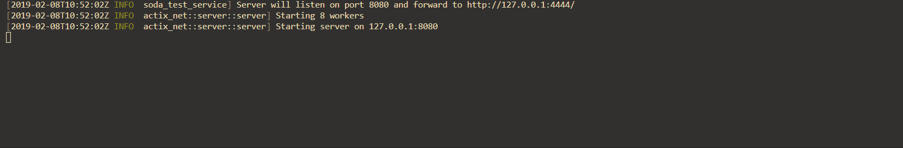

# SODA - Test Service [](http://makeapullrequest.com) [](https://travis-ci.org/voyages-sncf-technologies/soda-test-service) [](https://codecov.io/gh/voyages-sncf-technologies/soda-test-service) [](https://crates.io/crates/soda-test-service) [](https://gitter.im/voyages-sncf-technologies/soda-test-service?utm_source=badge&utm_medium=badge&utm_campaign=pr-badge&utm_content=badge)

> Plase note that the API will strongly evolve until the stable version in 1.0.0. Do not use if you're looking for a stable software.

The test service is a microservice belonging to the project Selenium On Demand Acronym. It acts like a reverse proxy in front of your Selenium hub. The test service is useful to :

- Get some insights on test sessions (teams, browers, os)
- Correlate test session failures to specific OS / browers
- Follow the test sessions in realtime



# Getting Started

These instructions will get you a minimal Selenium Grid with :

- A Selenium hub
- A test-service in front of your hub
- A Selenium node Chrome (Linux)
- A Selenium node Firefox (Linux)

## Docker compose

### By using our [docker-compose.yml](docker-compose.yml)

- `docker-compose up -d`
- [http://localhost:8080](http://localhost:8080)

### By adding the test service to your docker compose

Copy the following snippet to add the test service in your docker-compose file and customize it as you want. It's fully compatible with the official repositories of [SeleniumHQ/docker-selenium](https://github.com/SeleniumHQ/docker-selenium).


```
test-service:
  image: soda/test-service:0.3.3
  ports:
    - "8080:8080"
  environment:
    - HUB_PORT_4444_TCP_ADDR=hub
    - HUB_PORT_4444_TCP_PORT=4444
  networks:
    - your-selenium-network
```

Then run your services with the following docker-compose command :

```
# Equivalent to docker-compose up -d test-service hub chrome firefox
docker-compose up -d
```

Finally access the Selenium hub through the test-service : `http://localhost:8080`

# Development

## Prerequisites

- [Install rust](https://www.rust-lang.org/tools/install)

> Pro tip : when you're developing, always use [`cargo check`](https://rust-lang-nursery.github.io/edition-guide/rust-2018/cargo-and-crates-io/cargo-check-for-faster-checking.html) to avoid long build times.
> Then, when you are ready to test your work, use `cargo run` which will build a non-optimized binary and launch it.

## Launch the Selenium grid behind the test service

```bash
# Launch the Selenium hub with chrome and firefox on localhost:4444
docker-compose up -d hub chrome firefox

# Launch the test service on localhost:8080 and forward requests to the hub, a default client timeout is set to 60s
# Arguments : <LISTEN ADDR>:<LISTEN PORT> <FWD ADDR>:<FWD PORT> <DURATION_IN_SECS>
./soda-test-service.exe --listen=localhost:8080 --forward=localhost:4444 --timeout=300
```

## Tests
```bash
cargo test
```

You can also get the code coverage with [Tarpaulin](https://crates.io/crates/cargo-tarpaulin) :

```bash
cargo install cargo-tarpaulin && cargo tarpaulin

# You can also generate the html report
cargo tarpaulin -o Html --output-dir ./report
```

# License

This project is licensed under either of

- Apache license, version 2.0, ([LICENSE-APACHE](LICENSE-APACHE) or [http://www.apache.org/licenses/LICENSE-2.0](http://www.apache.org/licenses/LICENSE-2.0))
- MIT license ([LICENSE-MIT](LICENSE-MIT) or [http://opensource.org/licenses/MIT](http://opensource.org/licenses/MIT))

at your option.

## Contribution

Your contribution is welcome! You can find more information in the [CONTRIBUTING.md](CONTRIBUTING.md).

Unless you explicitly state otherwise, any contribution intentionally submitted for inclusion in the work by you shall be dual licensed as above, without any additional terms or conditions.
